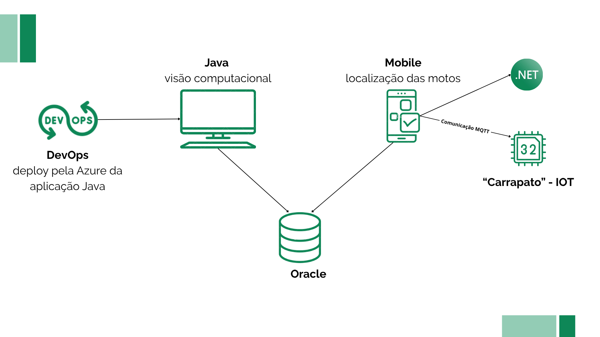

# SmartPátio — Challenge Mottu

O **SmartPátio** é um sistema web, desenvolvido em Thymeleaf, Spring Boot e Spring Security, com o objetivo de otimizar a **gestão** das motos nos pátios da Mottu. A solução vem como uma integração ao sistema que a Mottu utiliza atualmente, automatizando etapas manuais e resolvendo a dor da localização rápida das motos.

## Contexto da Solução

- **Corredor inteligente:** câmera com visão computacional e OCR para leitura automática de placas na entrada/saída
- **Dispositivo IOT (carrapato):** dispositivo acoplado à moto, composto por ESP32, LED âmbar, buzzer audível e acoplamento magnético.
- **Sistema Web:** interface para registro de históricos (de entrada e saída), gestão das motos no pátio, integrada ao sistema da Mottu.


---

## 📖 Sobre o Projeto
O **SmartPatio** é uma aplicação web que permite:
- Registrar entrada e saída de motos em filiais.
- Vincular motos a *carrapatos* (dispositivos de rastreamento).
- Gerenciar usuários (Gestores e Funcionários).
- Exibir estatísticas em tempo real no dashboard.
- Acompanhar nível de bateria dos carrapatos.

---

## 🏗 Arquitetura do JAVA 

O **SmartPatio** segue o padrão de arquitetura **MVC (Model-View-Controller)**, garantindo uma separação clara entre as responsabilidades da aplicação.

### 📂 Camadas

- **Controller:** Recebe as requisições HTTP do navegador (cliente) e direciona as ações necessárias.  
- **Service:** Contém as regras de negócio — aqui estão as operações principais, como registrar entradas, saídas e gerar dados para o dashboard.  
- **Repository:** Responsável pela comunicação com o banco de dados Oracle, utilizando o **Spring Data JPA** para simplificar consultas e persistência de dados.  
- **Model (Domain Model):** Representa as entidades da aplicação (como `Moto`, `Carrapato`, `Usuario`), mapeadas com **JPA**.  
- **DTOs (Data Transfer Objects):** Fazem a ponte entre as camadas, transferindo dados de forma otimizada e segura.  
- **Templates (View):** Utilizam o **Thymeleaf** para renderizar as páginas HTML dinamicamente, exibindo as informações retornadas pelo backend.

### 🔄 Fluxo Completo da Aplicação

1. O usuário acessa o navegador e entra em uma rota (por exemplo, `/perfil` ou `/dashboard`).  
2. O **Controller** recebe a requisição e aciona o **Service** correspondente.  
3. O **Service** executa a lógica de negócio (por exemplo, buscar histórico de movimentações ou registrar uma nova moto).  
4. Caso precise de dados, o **Service** utiliza o **Repository** para se comunicar com o banco Oracle.  
5. O resultado é retornado ao **Controller**, que envia esses dados para o **Template Thymeleaf**.  
6. O **Template (View)** renderiza as informações de forma dinâmica, exibindo ao usuário na interface web.

Fluxo:
```
Controller → Service → Repository → Database → View (Thymeleaf)
```
> Essa estrutura permite **alta organização, manutenção facilitada e escalabilidade**, além de garantir uma **integração fluida com o banco Oracle e o restante da solução SmartPatio**.
---

## 🧱 Arquitetura do Sistema
A arquitetura da solução SmartPatio integra diversas camadas e tecnologias —
desde o frontend com Thymeleaf até o backend com Spring Boot e o banco Oracle.



> Diagrama representando a comunicação entre os módulos da solução:
> - Java (Visão Computacional e Gestão do Pátio)
> - App Mobile (Localização de motos via IoT)
> - API .NET e Banco Oracle (Integração e persistência)
> - Azure DevOps (CI/CD e deploy)
> - QA (organização de sprints e testes)
---
## ⚙️ Funcionalidades
✅ Autenticação e autorização com Spring Security.  
✅ CRUD de usuários e perfil.  
✅ Registro de entrada/saída de motos.  
✅ Dashboard com:
   - Motos ativas e finalizadas.
   - Funcionários da filial.
   - Nível de bateria dos carrapatos.  

---

## 🛠 Tecnologias
- **Java 17**
- **Spring Boot 3**
- **Spring Data JPA**
- **Spring Security**
- **Thymeleaf**
- **Hibernate**
- **Oracle**
- **Flyway** (migrations)
- **Lombok**

---

## 📋 Pré-requisitos
Antes de rodar o projeto, você precisa ter instalado:
- [Java 17+](https://www.oracle.com/java/technologies/javase/jdk17-archive-downloads.html)
- [Maven 3.8+](https://maven.apache.org/)
- Banco de dados (Oracle ou H2 em memória)

---

## ▶️ Instalação e Execução
1. Clone o repositório:
   ```bash
   git clone https://github.com/MariaEdPaixao/SmartPatio-Java.git
   cd smartpatio
   ```

2. Crie um arquivo .env na raiz do projeto com suas credenciais do Oracle:   
   ```bash
   DB_USERNAME=SEU_USUARIO
   DB_PASSWORD=SUA_SENHA
   ```
   > Essas variáveis são carregadas automaticamente pela classe EnvConfig, garantindo que dados sensíveis (como usuário e senha do banco) não fiquem expostos no código.

3. Verifique o arquivo **application.properties**:

   Ele já utiliza as variáveis do .env:
   ````properties
   spring.datasource.url=jdbc:oracle:thin:@oracle.fiap.com.br:1521:ORCL
   spring.datasource.username=${DB_USERNAME}
   spring.datasource.password=${DB_PASSWORD}
   spring.datasource.driver-class-name=oracle.jdbc.OracleDriver
   
   spring.jpa.database-platform=org.hibernate.dialect.OracleDialect
   spring.jpa.show-sql=true
   spring.jpa.hibernate.ddl-auto=none
   spring.jpa.properties.hibernate.format_sql=true
   
   spring.flyway.baseline-on-migrate=true
   ````

4. Inicie a aplicação:
   ```bash
   mvn spring-boot:run
   ```

5. Acesse no navegador:
   ```
   http://localhost:8080
   ```

## ☁️ Deploy online (Azure App Service)
O **SmartPatio** também está disponível online, demonstrando a integração da disciplina de **DevOps** com **Azure**.

Utilizamos **pipelines automatizadas no Azure DevOps** para realizar build, test e deploy contínuos a cada novo commit.

 Acesse o sistema online:
 [https://smartpatio.azurewebsites.net/](https://smartpatio.azurewebsites.net/)
   
## 🐳 Executar via Docker

O sistema Web da SmartPatio desenvolvido em Java com Thymeleaf está disponível como imagem pública no Docker Hub: `mariaedpaixao/smartpatio-java`.

- Pré-requisito: ter o Docker instalado e acesso à base Oracle.
- A imagem escuta na porta interna 8080.

Passos:
1) Baixe a imagem
```
docker pull mariaedpaixao/smartpatio-java
```
2) Execute o container:
```
docker run -d -p 8080:8080 -e DB_USERNAME=SEU_USUARIO -e DB_PASSWORD=SUA_SENHA --name smartpatio mariaedpaixao/smartpatio-java:latest
```

Acesse o sistema web: http://localhost:8080

---

## 📂 Migrations
As migrations são gerenciadas pelo **Flyway**.  
Exemplos:
- `V2__create_tables.sql` → Criação das tabelas principais (`usuario`, `filial`, `moto`, etc.).
- `V3__insert_initial_data.sql` → Inserção de filiais, motos e carrapatos iniciais.
- `V4__comments_tables.sql` → Comentários nas tabelas para documentação.
- `V5__add_indexes.sql` → Índices para melhorar performance.

---

## 📊 Dashboard
O dashboard apresenta:
- 📌 Lista de motos **ativas no pátio** (com placa e carrapato vinculado).  
- 📌 Lista de motos que **já saíram** do pátio.  
- 📈 Gráfico de níveis de bateria dos carrapatos.  
- ➕ Atalho para **registrar entrada/saída** de motos.

---

## 🤝 Integrantes

| Nome                              | RM     | GitHub                                             |
| --------------------------------- | ------ | -------------------------------------------------- |
| **Laura de Oliveira Cintra**      | 558843 | [@Laura-Cintra](https://github.com/Laura-Cintra)   |
| **Maria Eduarda Alves da Paixão** | 558832 | [@MariaEdPaixao](https://github.com/MariaEdPaixao) |
| **Vinícius Saes de Souza**        | 554456 | [@ViniciuSaeSouza](https://github.com/ViniciuSaeSouza) |
